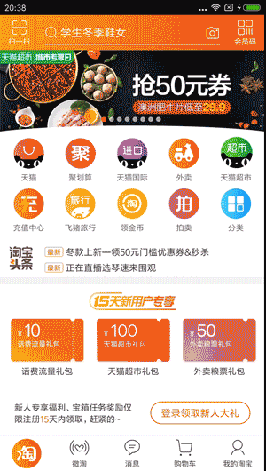

# PriceAnalysisAssistant
淘宝、京东宝贝价格分析助手，一键保存当前所收藏宝贝的价格实时价格，以后购买前可分析当前价格浮动，便于理性购买！

## 介绍

马上就要到双十一了，两只灵活的双手开始跃跃欲试...

鼠标不够灵敏? 买! 硬盘空间不足? 买! 键盘跪坏了? 买!

床头零食吃完了? 去年的买衣服又勒肚子了? 梦中情人的生日就要到了? 买买买!

淘宝购物车收藏夹的宝贝攒了一大堆，就等着双十一的到来了。

但是，很多东西双十一真的会便宜吗？答案是不一定。

稍微懂点套路的人都知道，很多店家都喜欢在做活动之前就开始先把商品价格抬上去，在活动当天再把价格大幅降下来，制造出打低折的假象。
如果我们平时很少关注这件商品，是很难发现出此时的活动到底是真的降价还是完全的套路。

在此灵感之下，我觉得开发这款软件是非常必要的。目的就是为了让大家花费更少的时间去区别真的降价还是先抬再降，以便自己可以更理性地挑选和购买商品。

## 功能

* 添加宝贝
* 管理宝贝
* 宝贝价格分析

### 添加宝贝

* 从手机淘宝中添加宝贝

在手机淘宝的宝贝详情界面，选择分享并复制链接（实际为淘口令），即可在 APP 中的『添加宝贝』中进行添加

 

* 从链接或者宝贝id 中添加宝贝

除了可以添加手机淘宝中的淘口令之外，还可以将网页链接中的宝贝详情的链接或者宝贝id 复制下来进行添加

* 批量添加宝贝

如果想批量导入多个宝贝，可以将宝贝链接或者宝贝id 分行存入 sdcard/lshapp/Paa/import/items.txt 文件中（自行创建目录和文件）；然后在设置界面中点击『批量导入宝贝』

### 管理宝贝

在 APP 首页可以查看已经添加的所有宝贝。长按标签可以打开淘宝链接，以网页形式查看淘宝中的宝贝详情。

如果添加的宝贝很多，可以将其按标签进行分类。点击『编辑』，选择标签，然后可以对其进行『移至其他标签』或者『删除』操作。

宝贝的价格不会自行刷新，需要自己手动进行刷新：点击首页『更新所有宝贝』。不建议一天内对所有宝贝进行多次更新，每天或者隔几天更新一次就好了。

更新后，APP 会记录当时的商品价格，并对价格进行分析，生成相关提示和价格曲线。

### 宝贝价格分析

点击首页列表中的宝贝，可以进行价格分析界面，该界面可以查看以前保存过的历史价格曲线图。看完曲线，对于自己要不要买这个宝贝，相信你的心中会多几分肯定。

每个宝贝都可以设置提醒价格和正常价格。提醒价格用于在宝贝价格低于提醒价格时，会及时发出通知，提醒自己『嘿，差不多该买它了！』；
正常价格是为了在宝贝不断浮动的价格当中，尽快地清楚它平时该卖多少钱，别让价格晃瞎自己的双眼。

从第二次记录的价格开始，首页的商品列表都是对一些我们平时可能关注的价格浮动进行提示。比如『比正常价格低20元』、『比上一次上涨20元』等，帮助我们快速分析价格趋势。

列表顶部可以对状态进行筛选，如果『价格较低』（宝贝价格低于提醒价格或正常价格时）、『降价中』（宝贝价格低于收藏时价格或上一次价格）。

## 总结

希望 APP 能帮助大家在逛淘宝（后续应该也可以逛京东的）时不仅节省宝贵的纠结时间，还是剩下一大波被商家套路的钱。祝大家剁手愉快！

APP 会根据受欢迎程度和自己的心情进行更新的。